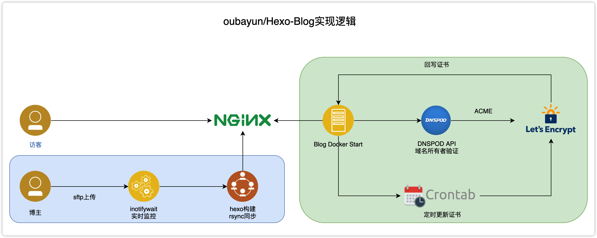
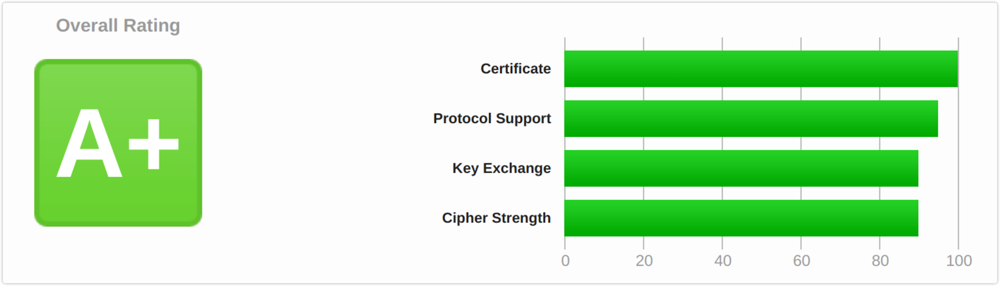
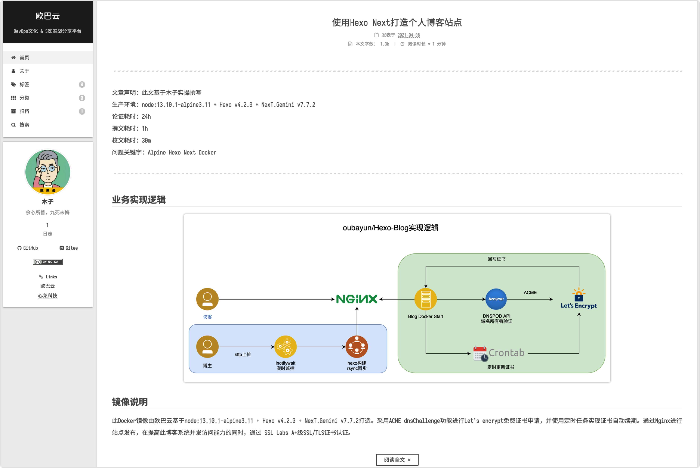

---
文章声明：此文基于木子实操撰写。 \
生产环境：node:13.10.1-alpine3.11 + Hexo v4.2.0 + NexT.Gemini v7.7.2 \
论证耗时：24h \
撰文耗时：1h \
校文耗时：30m \
问题关键字：Alpine Hexo Next Docker
---

# 业务实现逻辑


# 镜像说明
此Docker镜像由[欧巴云](https://www.oubayun.com)基于node:13.10.1-alpine3.11 + Hexo v4.2.0 + NexT.Gemini v7.7.2打造。采用ACME dnsChallenge功能进行Let's encrypt免费证书申请，并使用定时任务实现证书自动续期。通过Nginx进行站点发布，在提高此博客系统并发访问能力的同时，通过 [SSL Labs](https://www.ssllabs.com/) A+级SSL/TLS证书认证。
<!-- more -->


# 站点主界面


# 版本说明
## 2020年3月27日主要功能说明 v1.0
* 采用Alpine3.11构建Hexo v4.2.0+NexT.Gemini v7.7.2个人博客Docker镜像；
* 新增基于Let's encrypt ACME DNS证书自动生成功能（腾讯云）；
* 新增inotifywait文件级修改监控，实现静态网站自动构建；
* 基于Nginx进行网站发布，提高网站并发能力；
* 配置rsync增量同步，实现vNote所写Markdown文档，直接sftp上传后自动构建部署功能；

## 2020年3月30日主要功能说明 v1.1
* 添加Nginx gzip模块；
* 配置站点启动Nginx gzip压缩功能；

## 2020年4月4日主要功能说明 v1.2
* 修正inotifywait监控文件多事件下Markdown文档多次构建部署问题；
* 新增基于vNote编写的Markdown文档sftp同步以后，_v_images自动替换路径为绝对路径功能；

## 2020年5月3日主要功能说明 v1.3
* 本次更新主要针对SEO优化；
* 添加sitemap功能；
* 添加robots.txt；
* 优化文件链接地址，自动翻译成拼音，并修改连接地址为https://域名/文章拼音名.html；
* 添加nofollow功能，并排除友情链接；

## 计划功能实现说明 v1.4
* 新增基于Let's encrypt ACME DNS证书自动生成功能（阿里云）；
* 新增基于阿里云、腾讯云 DNSAPI实现A记录解析自动添加；

# 部署方式
纯Docker方式部署如下：
```bash
docker run -p 80:80 -p 443:443 -v /mdfiles:/blog/source/_posts -e \
"domainname=oubayun.com" -e "DP_Id=xxxx" -e "DP_Key=xxxx" \
oubayun/hexo-blog:latest
```
